**SENG 438 - Software Testing, Reliability, and Quality**

**Lab. Report #3 – Code Coverage, Adequacy Criteria and Test Case Correlation**

| Group: 8      |
|-----------------|
| Danny Duong 30120124                  |   
| Kevin Johnson 30124217                 |   
| Kaito Sugimura 30093204                |   
| Joshua Walters 30119430                |   

# 1 Introduction

This lab has a similar focus to the previous one, as it once again involves unit testing. As before, we familiarize ourselves with the usage of JUnit and other testing tools followed by implementation (enhancement) of the test suite. The major difference between the testing performed in this lab the the previous lab (#2) is that this lab involves a different technique (white-box coverage criteria) in deciding what test cases to develop.

# 2 Manual data-flow coverage calculations for DataUtilities.calculateColumnTotal and [Some other method] methods

### DataUtilities.calculateColumnTotal

#### Data Flow Graph

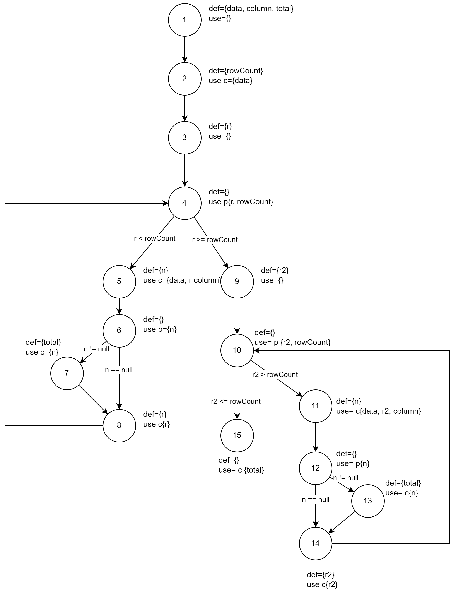

#### Def-use Sets per Statement

| Node | Definitions | P-Uses| C-Uses|
|-|-|-|-|
| 1 | {data, column, total} | {}| {}
| 2 | {rowCount} | {}|{data}|
| 3 | {r} | {}|{}|
| 4 |  {} | {r, rowCount}|{}|
| 5 | {n} | {}|{data, r, column}|
| 6 | {} | {n} |{}|
| 7 | {total} | {} | {n}|
| 8 | {r} | {} |{r}|
| 9 | {r2} | {}|{}|
| 10 | {} | {r2, rowCount} |{}|
| 11 | {n} | {} |{data, r2, column}|
| 12 | {} | {n} |{}|
| 13 | {total} | {} |{n}|
| 14 | {r2} | {} |{r2}|
| 15 | {} | {} |{total}|

#### DU-pairs per Variable

Note that some DU-pairs are infeasible.

| Variable | Defined In | DCU | DPU
|-|-|-|-|
| data | {1} | {2, 5, 11} | {}|
| column| {1} | { 5, 11} | {}|
| total| {1, 7, 13} | {15} | {}|
| rowCount|{2} | {} | {(4,5), (4,9), (10, 15), (10, 11)}|
| r |{3, 8} |{5, 8} | {(4,5), (4,9)}|
| n |{5, 11} |{7, 13} | {(6, 7), (6, 8), (12, 14), (12, 13)}|
| r2 | {9, 14}|{2, 5, 11} | {}|

#### Covered Pairs
 Variable | DCU Covered | DPU Covered
|-|-|-|
| data | true | NA|
| column| true | NA|
| total|true | NA|
| rowCount|NA | true|
| r |true | {(4,5), (4,9)}|
| n |true | true|
| r2 |true | NA|

#### DU-pair Coverage

CU = 7 PU = 12 CUc = 7 PUc = 12 CUf = 0 PUf =0
(CUc+PUc)/((CU+PU)-(CUf+PUf) = (7+12)/((7+12)-(0+0)= 1 = 100%

### DataUtilities.equal
####Data Flow Graph

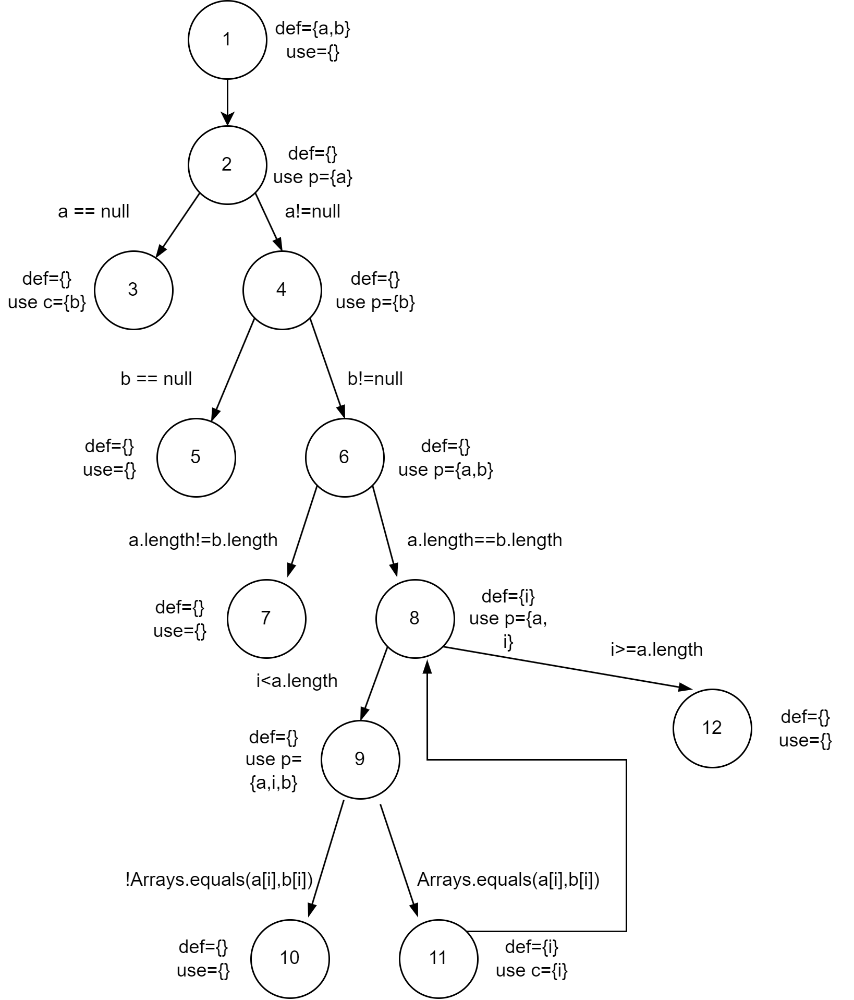
#### Def-use Sets per Statement
| Node | Definitions | Uses|
|-|-|-|
| 1 | {a, b} | {}|
| 2 | {} | {a}|
| 3 | {} | {b}|
| 4 | {} | {b}|
| 5 | {} | {}|
| 6 | {} | {a,b}|
| 7 | {} | {}|
| 8 | {i} | {a}|
| 9 | {} | {a, i, b}|
| 10 | {} | {}|
| 11 | {i} | {i}|
| 12 | {} | {}|

#### DU-pairs per Variable

| Variable | DU-pairs |
|-|-|
| a| (1,2), (1,6), (1,8), (1,9) |
| b| (1,3), (1,4), (1,6), (1,9) |
| i| (8,8), (8,9), (8,11), (11,8), (11,9), (11,11),|

#### Covered Pairs
| Variable |Covered |
|-|-|
| a| true, true, true, true |
| b| true , true , true , true |
| i| true , true , true , true , true , true |

#### DU-pair Coverage

| DU-pair |Covered |
|-|-|
| (1,2)| true |
| (1,6)| true |
| (1,8)| true |
| (1,9)| true |
| (1,3)| true |
| (1,4)| true |
| (1,6)| true |
| (8,8)| true |
| (8,9)| true |
| (8,11)| true |
| (11,8)| true |
| (11,9)| true |
| (11,11)| true |

# 3 A detailed description of the testing strategy for the new unit test

Now that we have access to the SUT source code, we will now use white-box testing strategies to generate new unit tests. In particular, we will focus on three code coverage areas: statement coverage, branch coverage, and method coverage.

Statement coverage is the simplest level of code coverage and involves executing every line of code at least once. To increase statement coverage, we will create unit tests that cover code statements not yet executed in our existing tests. Due to unreachable code, there may be a limit to the statement coverage we can reach.

Branch coverage is a more sophisticated level of coverage and involves executing all possible branches in the code being tested. To increase branch coverage, we will create unit tests that cover branches not yet covered in existing tests. Due to impossible conditions, there may be a limit to the branch coverage we can reach.

Method coverage involves ensuring that each method in the code is executed at least once. It will be trivial to increase method coverage by creating unit tests that cover untested methods.

# 4 A high level description of five selected test cases you have designed using coverage information, and how they have increased code coverage

We developed test cases for calculateColoumnTotal using the information calculated above. The first test case we developed was calculateColoumnTotalForTwoValues. Using the data flow graph and seeing that at node 4 the rowCount must be larger than one to run through some sections of code we made a test that uses data with 2 rows to account for this.

The second test case we developed was calculateColumnTotalForNegativeColoumnSize. Referencing the flow graph again we observed that certain sections of code are only reached when r2 is greater than the row count. Seeing as r2 is defined as 0 this indicates a negative row count. To account for this in this test case we used input data that would return a negative row count to achieve this coverage.

A third test case we developed was calculateRowTotalForNullvalidRow. We observed from the graph that at node 6 that a branch is not covered if we do not input data with some null values. To account for this and achieve coverage, the input data has some null values.

The forth test case we developed contains in Range.java. To get through the first 2 branch statements for a total of 4 branches was trivial and easy to test. However, the problem was to cover all the conditions in the return statement. This seemed impossible at first, however, we quickly noticed by using NaN, we can bypass the first two if conditions and completely test this return statements conditions. 

The fifth notable test case we developed was combineIgnoringNaN in Range.java. There are 2 nested if statements with an additional single if statement in the end. As each nest of if statements or for loops (seen in other tests) increases the complexity and branches, we needed to be careful we were testing all possible routes of the branches. For example for the first if statement, we would need two "true" conditions to satisfy the nested if statement branches inside and one "false" condition to satisfy possible branch of completely skipping the if statement. Note that if we were to fully test the conditions inside the if statement, we would need even more tests.

# 5 A detailed report of the coverage achieved of each class and method (a screen shot from the code cover results in green and red color would suffice)

Note that there are sections of the SUT code that are unreachable, which is why we could not increase our coverage higher than we already did.

## DataUtilities
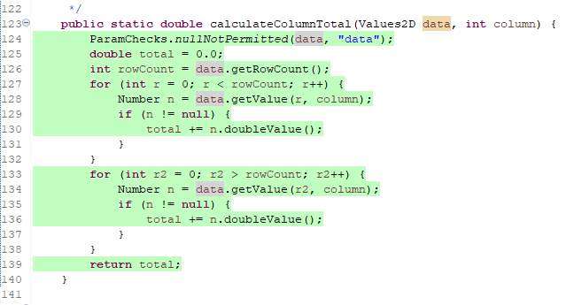
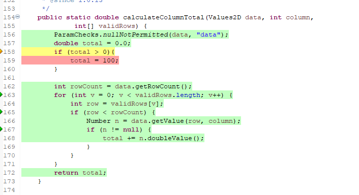
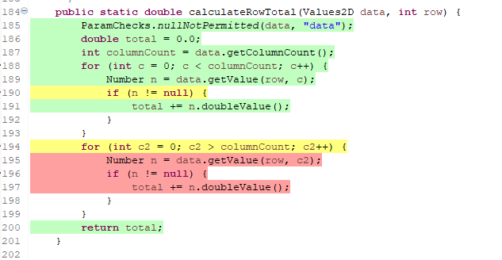
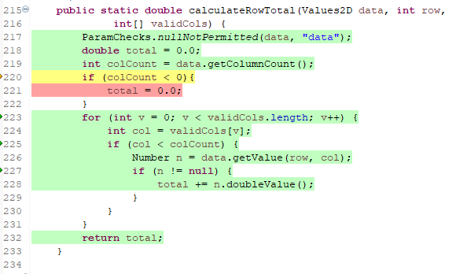
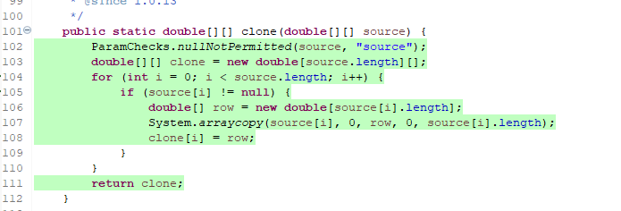
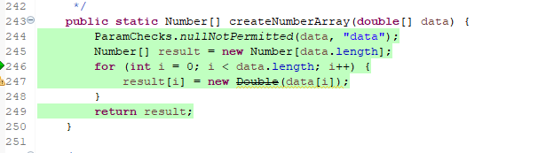
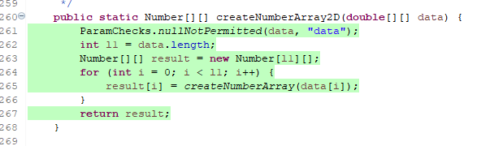
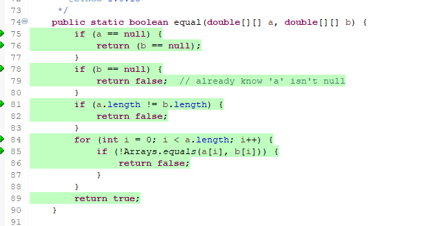
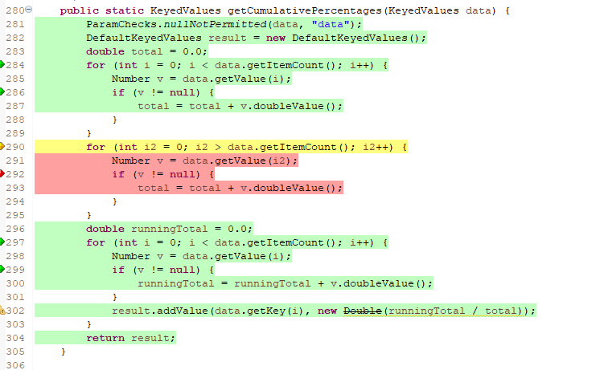

## Range
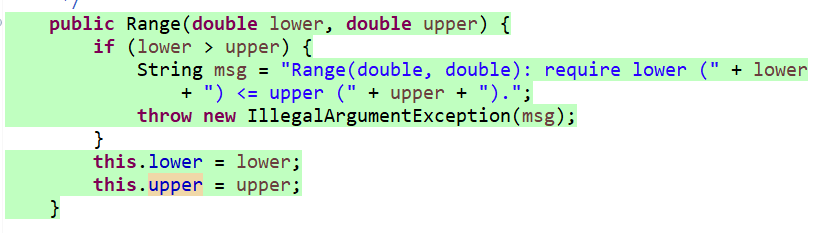
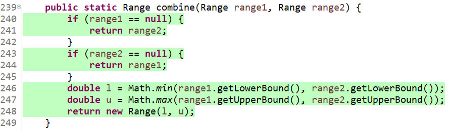
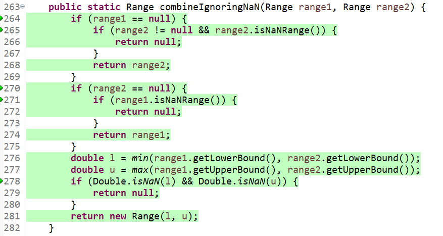
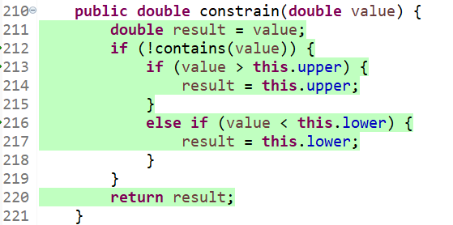
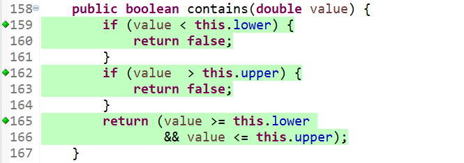
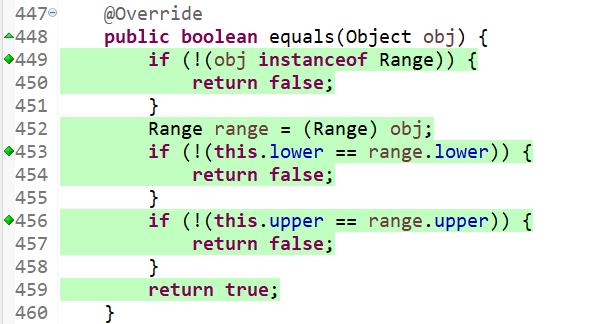
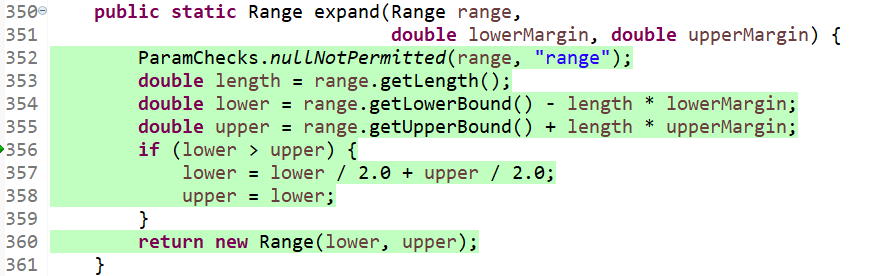
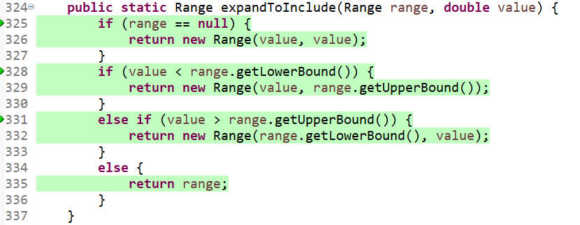
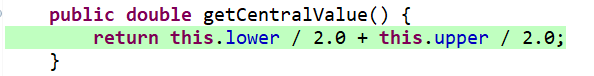
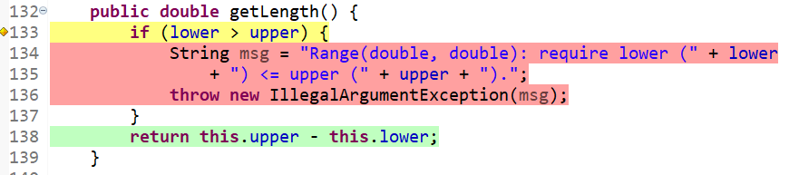
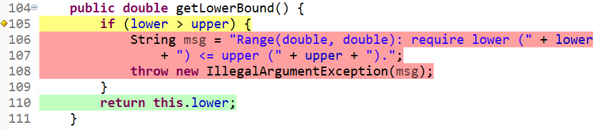
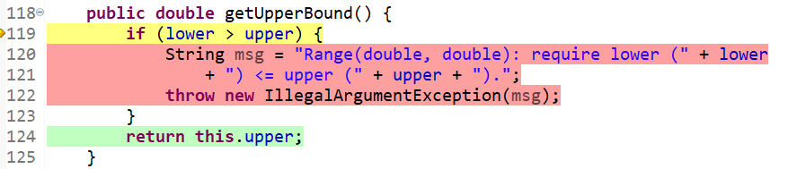
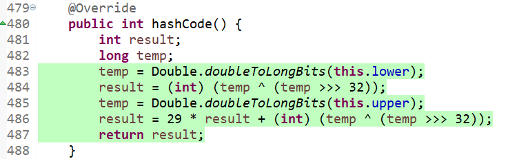
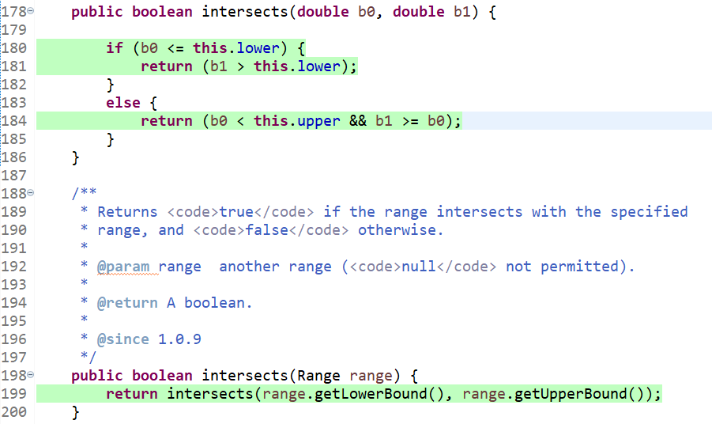
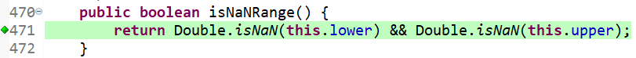
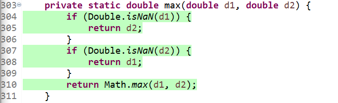
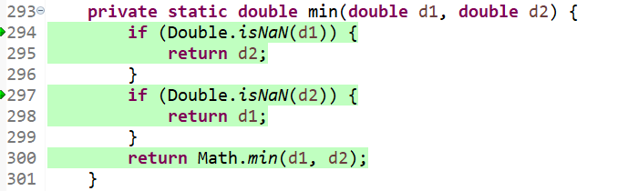
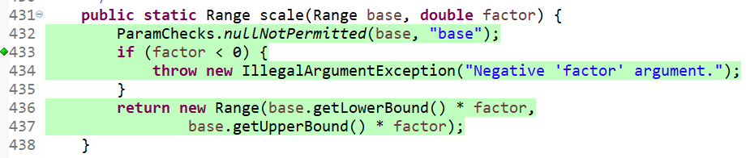
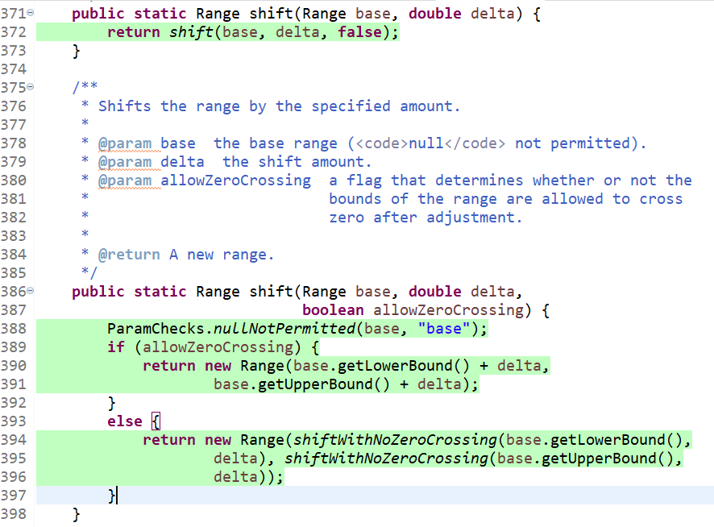
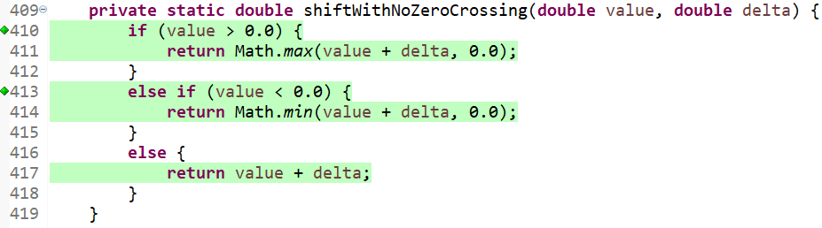
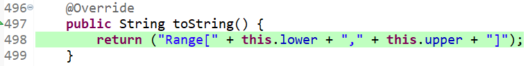

# 6 Pros and Cons of coverage tools used and Metrics you report

EclEmma integrates well with the Eclipse IDE. It was easy to install and quick to acquire code coverage. Additionally, it never crashed and functions reliably. However, the UI is not discoverable; it was unclear at first how to view other coverage types aside from the default instruction coverage. It also appears to be missing condition coverage, which compelled us to substitute this coverage type for method coverage. It is also worth noting that EclEmma does not provide a way for the tester to know which branches are being tested. That is, for example, if a condition has 4 branches, and only 1 is tested, the tool will only tell you ¼ branches are tested; however, no other information is provided. 

# 7 A comparison on the advantages and disadvantages of requirements-based test generation and coverage-based test generation.

### Requirements-based test generation

Advantages:

- Helps to ensure that the software being tested meets the listed requirements
- Focuses testing efforts on the most important functionalities of the system.
- Helps to meet regulatory compliance, where certain requirements are a must

Disadvantages:

- Can be time-consuming and expensive to create and maintain test cases for every requirement
- Assumes that the requirements are accurate and complete, which might not always be the case
- Doesn’t guarantee that all code paths are tested

### Coverage-based test generation

Advantages:

- Helps ensure that all code paths are tested
- Can identify areas of the code that aren’t covered by existing test cases
- Coverage criteria can be measured automatically, making it faster to see where tests should be added
- Can discover defects that may not be caught by requirements-based testing

Disadvantages:

- May miss coverage for some requirements
- Doesn’t necessarily test the most important functionalities of the system
- Can possibly result in redundant or unnecessary test cases

Both requirements-based and coverage-based test generation have their own strengths and weaknesses, and the choice of which approach to use depends on the specific needs of the software testing effort.

# 8 A discussion on how the team work/effort was divided and managed

For this assignment we divided the work equally.

# 9 Any difficulties encountered, challenges overcome, and lessons learned from performing the lab

The difficulties came when trying to find a reasonable place to stop with the testing. Our goal was to test and get the highest coverage we could. It took a lot of analysis and discovery to see if a particular line was simply unreachable because of infeasibility or just because we could not find a way. In the end, we tried to use logic and reasoning to prove the ones we missed are for sure infeasible. We learned many things through trying to cover all possibilities. We think the biggest lesson is how much time it takes to try to cover all these possibilities. In bigger projects, trying to cover each possibility would take an unreasonable amount of time and a lot of the testing we have done was redundant and unnecessary. It may require the testers experience and knowledge to figure out good percentages to stop as well as specific tests to cover more than others. 

# 10 Comments/feedback on the lab itself

Nothing particularly big. We thought this lab was fun and easy to follow along. 

